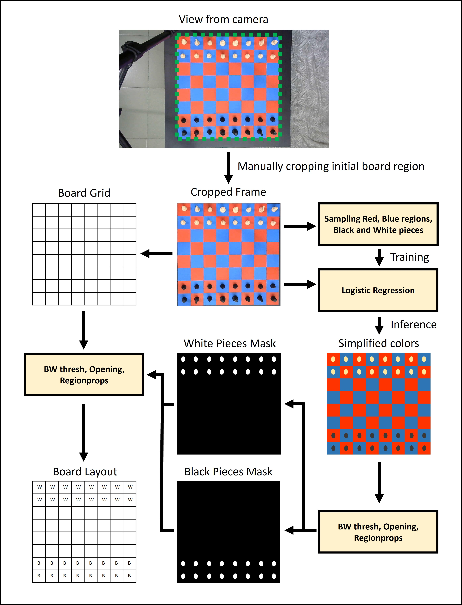
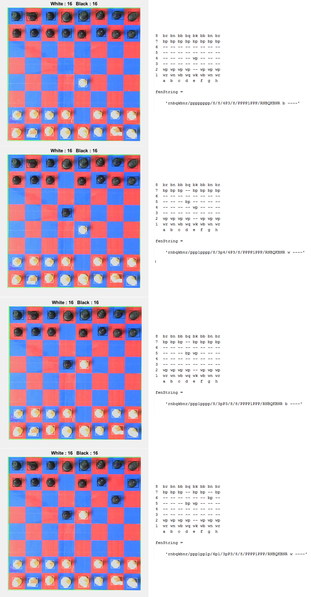

# Chess-Machine
We implemented a chess playing robot that uses an XY plotter machine for manipulating the pieces, webcam for a view of the chessboard and the <a href="https://stockfishchess.org/download/">Stockfish</a> chess engine for calculating moves by the machine. This robot can play chess with a human player.

Demonstration video:
https://youtu.be/TBJXJzK3z6o

[](https://www.youtube.com/watch?v=TBJXJzK3z6o "Click on the image to watch video!")


## Contents
- [Materials Used](#materials-used)
- [Working Procedure](#working-procedure)
- [Hardware Setup](#hardware-setup)
- [Discussion](#discussion)
- [Team](#team)

## Materials Used
Here is a list of materials used for building the chess machine
- PVC board as the base material
- Art papers for coloring the board
- Nylon rods of 1cm diameter as the guide rails
- Linear bearings for sliding alond the rails
- Stepper motors and belts
- A 9g servo motor
- A tiny magnet for holding chess pieces
- IRF540 MOSFETs for stepper motor driver
- A cheap computer PSU
- Arduino UNO for controlling stepper motors
- Lots of wires
- Webcam
- Computer


## Working Procedure
The chess machine has an image based input, a chess engine that works in tandem with MATLAB as the processing unit, and the physical XY plotter that acts as the ouput.

### Detection of Board and Chess Pieces

When a game session starts, the interface prompts the user with a view from the webcam for cropping out the board region. This could be done automatically, but we kept it manual for better precision. The user can crop out the bounding box of the actual board region from the snapshot - this bounding box helps greatly in the detection of chess pieces. The bounding box can be converted to a 8x8 grid that represents the chess board as a table.

We made the board red and blue, and the chess pieces are black and white - this made the overall detection process much easier. The board can be detected using red and blue channels of the RGB image. The white and black chess pieces can be detected using the brightness level. Problem arises when there is overbright or shadowed regions in the chess board that messes with the detection of black and white pieces. For solving this, we trained a regression model for multi-class classification of colors in the board. First, using the "calibrate_samples3.m" funciton multiple samples of red, blue, white and black regions are sampled and then converted to a very small dataset. Then "myOneVsAll.m" funciton is used to trained the logistic regression network for a multi-class classification of color pixels on the chess board. After each pixel is identified as a separate color, we convert the natural board color into a more uniform color distribution where the chess pieces can be more accurately identified. 

In the "get_board3.m" function, an image sample taken by the webcam is first passed through the logistic regression network and then the color channels are used to seperate red, blue, white and black layers.

```
pixels = [ones(size(R)) , R , G , B] ; % unrolled rgb matrix
colors = 1./(1+exp(-(pixels*all_theta'))) > logistic_thres ; % logistic regression prediction
```

White pieces are shown as regions of higher brightness, and black pieces are shown as regions of lower brightness. These are represented as two separate masks, and after morphological opening of these masks and detecting regions, the location of each chess piece can be seen by the computer. 
```
WHITE = imopen(WHITE,strel('disk',noise));
WHITE = ~imopen(~WHITE,strel('disk',noise));
BLACK = imopen(BLACK,strel('disk',noise));
BLACK = ~imopen(~BLACK,strel('disk',noise));

whitePieces = imresize(imcrop(WHITE,stats.BoundingBox),[640 640]);
blackPieces = imresize(imcrop(BLACK,stats.BoundingBox),[640 640]);

%% Identifying objects

detect_white = regionprops(whitePieces,'BoundingBox','Centroid','Area');
detect_black = regionprops(blackPieces,'BoundingBox','Centroid','Area');

```

<figure align="center">
    
    <figcaption>Perception framework</figcaption>
</figure>

The region detection function returns the centroids of each of the chess pieces, and we already know the bounding box of the entire board. The board bounding box is converted to a grid of 8x8 and the chess pieces are placed within that grid to know the board positions that are occupied by pieces in a tabular form. Using knowledge of the previous board configuration and comparing it with the current board configuration, we can understand which piece was recently moved. This information is then passed to the custom chess manager that retains memory of the board and checks for validity of moves. 


### Interpreting Board Configuration and Generating Moves

A generic chess game starts from a single position. The perception framework can identify the pieces on the board as black and white pieces only. We detect each piece by observing the displacement between two consecutive snapshots. This helps in determining piece movement, captures etc. The move is then passed to our own implementation of chess logic, that exports the current board configuration into a text format readable by the Stockfish chess engine. 

<figure align="center">
    
    <figcaption>Detecting moves and passing to stockfish</figcaption>
</figure>

```
board_new = get_board3(snapshot(cam));
difference_array = xor(board_prev,board_new);

%% implementation of chess logic to detect legality of move
y = checkLegal(b_board, difference_array);

%% update the current board configuration
update(b_board, difference_array)

%% convert to stockfish readable format
fenString = convert_to_fen(b_board)
pass_to_stockfish(fenString)
```

Stockfish can produce the next best move when any board configuration is passed as an input. We then apply a very simple path planning algorithm and send commands to the stepper motors via arduino to move around chess pieces as required by the move.

### Moving the Pieces Around


## Hardware Setup

A video demonstration of the internals of the XY plotter. https://youtube.com/shorts/JwAQECdfFwo

[](https://www.youtube.com/watch?v=JwAQECdfFwo "Click on the image to watch video!")

<!-- 
<figure align="center">
    
    <figcaption>Each key has a screw through it, and a wire connects each screw to veroboard 1 (veroboard 1 pulls down all the inputs to ground)</figcaption>
</figure>
-->

## Discussion

There are a few shortcomings of the project:
- We have used very cheap materials for the physical hardware. The stepper motors and the belts were especially bad. The board was also malleable, and tended to bend around the center region. The guide-rails were nylon rods, also bendy. No complaints about electrical hardware, just the mechanical part could have been way much better. We stuck to cheap materials because they could be easily modified by hand without needing heavy machinery.
- For the image processing part, we made the board red-blue to easily identify the chess pieces on the board. Normally chess boards are black and white. At that time we didn't have much idea about machine learning or deep learning techniques. Chess pieces on a black and white board can be easily detected using object detection algorithms. Pieces also can be individually identified. Machine learning would also allow the processing to be more robust and environment independent.
- Could have used a dedicated servo motor driver.
- Could have implemented the system using a Raspberry Pi instead of a clunky laptop.

Things that would be cool to implement:
- Training an AI using reinforcement learning to play chess with people
- Remotely playing chess with other human players using the chess machine. (without needing to stare at a computer screen!)

## Team

- Mir Sayeed Mohammad (EEE) (github - https://github.com/ClockWorkKid)
- Shafin Bin Hamid (EEE) (github - https://github.com/shafinbinhamid)
- Himaddri Roy (EEE) (github - https://github.com/himu587)
- Md. Asif Iqbal (EEE)
